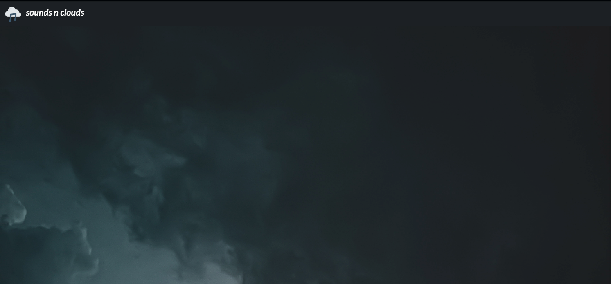
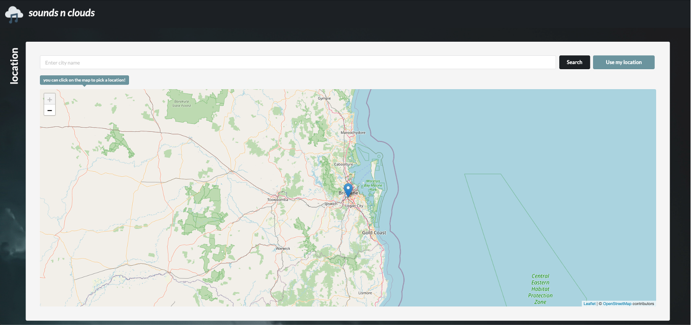

# soundsnclouds

#### How to run locally using `docker-compose` 

Requirements:
- Spotify premium account
- Docker Compose

Steps:
1. Download repo as .zip
2. Extract .zip and open up a command line interface with the extracted file as your current directory
3. Run `docker-compose build`
4. Run `docker-compose up`
5. The application should now be running on [localhost:3000](http://localhost:3000)
6. To exit the application, simply press `Ctrl+C` or run `docker-compose down`

Notes: you must have port 3000 free to run this application, due to the Spotify Web API redirect URI rules (will change this one day so that user running this must input their own client ID and set their own redirect URIs).

#### Common problems
If you are redirected to an empty page with just the header, then make sure location services are enabled in your browser. 

Once you've turned on location services, try refreshing the page.

